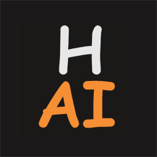

# Harmony Link UI

---

Harmony Link UI is the React-based web interface for Harmony Link, providing an intuitive and comprehensive dashboard for managing AI characters, integrations, and system configurations.

***Built with modern web technologies, Harmony Link UI delivers a responsive and user-friendly experience for configuring and monitoring your AI orchestration system.***

The interface is optimized for real-time interaction and provides seamless access to all Harmony Link features including AI module configuration, integration management, development tools, and system monitoring.

## Features

- **AI Module Configuration**: Configure Backend, TTS, STT, Movement, and Countenance modules
- **Integration Management**: Discover, configure, and control external AI services via Docker
- **Real-time Monitoring**: Live system status and event monitoring
- **Development Tools**: Built-in simulator and testing interfaces
- **Entity Management**: Configure and manage AI character entities
- **Voice Profiles**: Manage TTS and STT configurations
- **Docker Integration**: Visual interface for managing containerized AI services

## Technology Stack

- **React 18**: Modern React with hooks and functional components
- **Vite**: Fast build tool and development server
- **Tailwind CSS**: Utility-first CSS framework
- **Monaco Editor**: Integrated code editor for configuration files
- **Plotly.js**: Interactive charts and visualizations
- **Harmony Speech**: Integration with Harmony AI's speech services

## Development Setup

### Prerequisites

- Node.js 16+ and npm
- Harmony Link backend running (for API connectivity)

### Installation

```bash
# Clone the repository
git clone https://github.com/harmony-ai-solutions/harmony-link-ui.git
cd harmony-link-ui

# Install dependencies
npm install

# Copy environment configuration
cp .env.example .env

# Start development server
npm run dev
```

### Environment Configuration

The UI connects to the Harmony Link backend via environment variables. Configure `.env` based on your setup:

```bash
# For standalone Harmony Link
VITE_MGMT_API_URL="http://localhost"
VITE_MGMT_API_PORT="28081"

# For containerized Harmony Link
VITE_MGMT_API_URL="http://harmony-link"
VITE_MGMT_API_PORT="28081"

# API configuration
VITE_MGMT_API_PATH="/api"
VITE_MGMT_PUBLIC_API_PATH="/public"
VITE_MGMT_API_KEY="admin"
```

### Build for Production

```bash
# Build optimized production bundle
npm run build

# Preview production build
npm run preview
```

## Docker Deployment

### Building the Image

```bash
# Build the Docker image
docker build -t harmony-link-ui .

# Run the container
docker run -p 3000:3000 harmony-link-ui
```

### Using Pre-built Images

```bash
# Pull and run the latest image
docker pull harmonyai/harmony-link-ui:latest
docker run -p 3000:3000 harmonyai/harmony-link-ui:latest
```

## API Integration

The UI communicates with the Harmony Link backend through:

- **Management API**: Configuration, entity management, and system control
- **Events API**: Real-time event monitoring and development tools
- **Public API**: Status and health checks

Ensure your Harmony Link backend is running and accessible at the configured API endpoints.

## Project Structure

```
src/
├── components/          # React components
│   ├── integrations/   # Integration management components
│   ├── modules/        # AI module configuration components
│   └── settings/       # System settings components
├── services/           # API service layer
├── assets/             # Static assets and images
└── utils/              # Utility functions
```

## Contributing

1. Fork the repository
2. Create a feature branch (`git checkout -b feature/amazing-feature`)
3. Commit your changes (`git commit -m 'Add some amazing feature'`)
4. Push to the branch (`git push origin feature/amazing-feature`)
5. Open a Pull Request

## License

Licensed under the Apache 2.0 License - see the [LICENSE](LICENSE) file for details.

---

## About Project Harmony.AI


### Our goal: Elevating Human <-to-> AI Interaction beyond known boundaries.

Project Harmony.AI emerged from the idea to allow for a seamless living together between AI-driven characters and humans. This UI component is part of our larger ecosystem designed to democratize AI character development and deployment.

### How to reach out to us

[Official Website of Project Harmony.AI](https://project-harmony.ai/)

#### If you want to collaborate or support this Project financially:

Feel free to join our Discord Server and / or subscribe to our Patreon - Even $1 helps us drive this project forward.

 [Harmony.AI Discord Server](https://discord.gg/f6RQyhNPX8)

 [Harmony.AI Patreon](https://patreon.com/harmony_ai)

#### If you want to use our software commercially or discuss a business or development partnership:

Contact us directly via: [contact@project-harmony.ai](mailto:contact@project-harmony.ai)

---
&copy; 2023-2025 Harmony AI Solutions & Contributors

*Harmony Link UI is licensed and distributed under the Apache 2.0 License*
